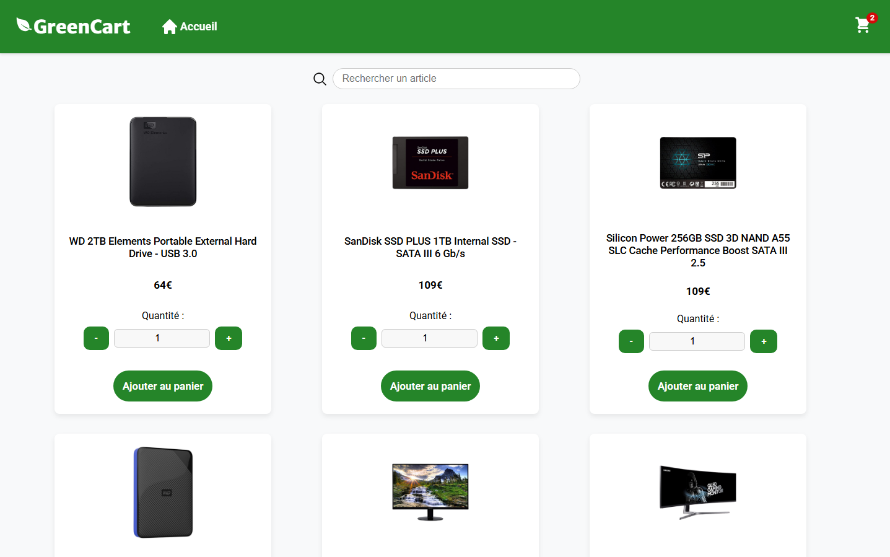

# GreenCart

GreenCart est une application simulant le système de panier d'un site de e-commerce fictif.

## Fonctionnalités

- afficher des produits fetchés de la [Fake Store API](https://fakestoreapi.com/)
- rechercher des produits grâce à une barre de recherche
- ajouter/retirer des articles du panier
- vider tout le panier
- gérer les quantités de chaque article du panier
- afficher un récapitulatif du prix de la commande



## Stack

- **React**
- **React Router DOM**
- **Context API**
- **React Icons**
- **CSS Modules**

## Installation

### Cloner le projet

```bash
git clone git@github.com:NzlThomas/greencart.git
```

### Installer les dépendances

A la racine du projet :

```bash
npm i
```

### Lancer le frontend

```bash
npm run dev
```
